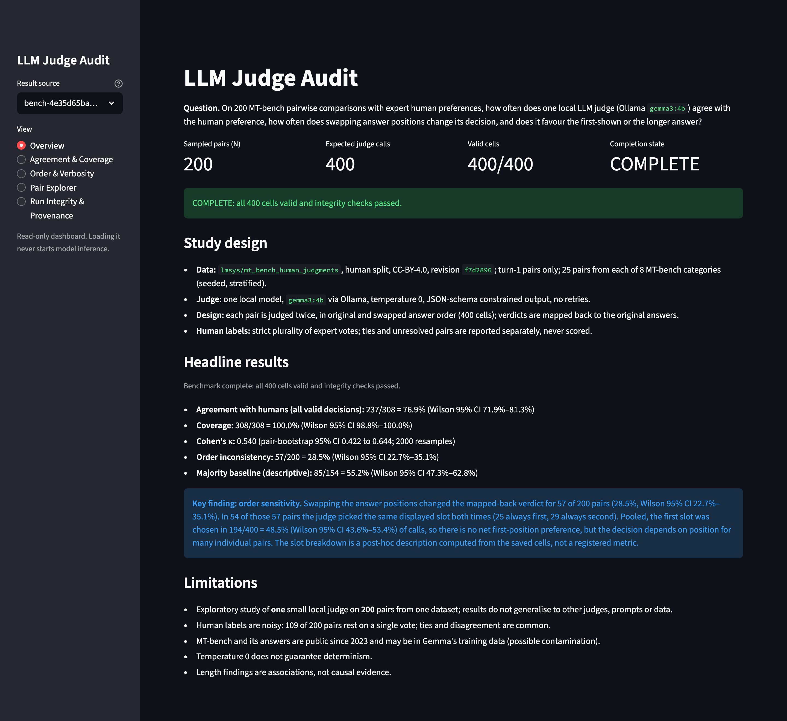
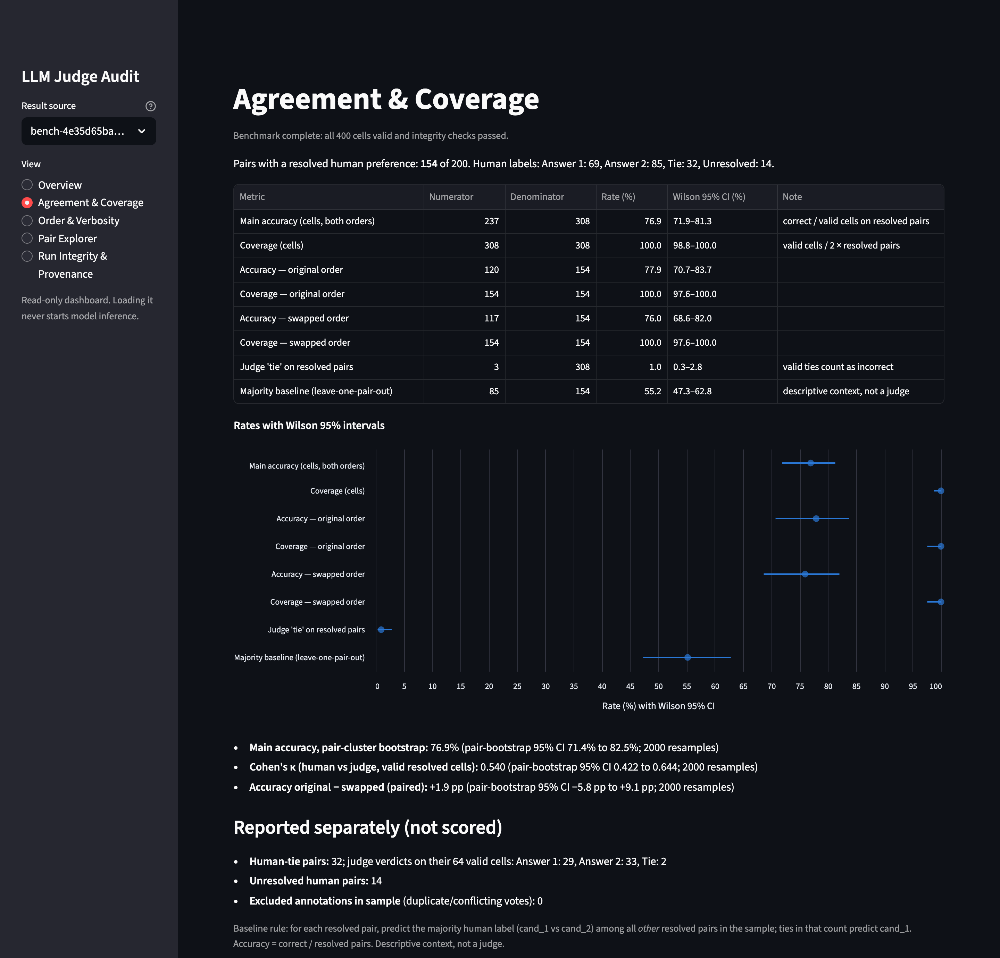
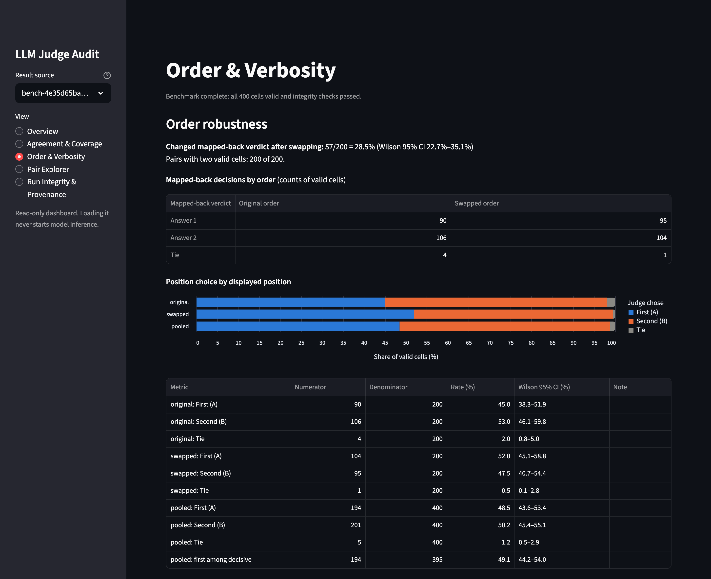
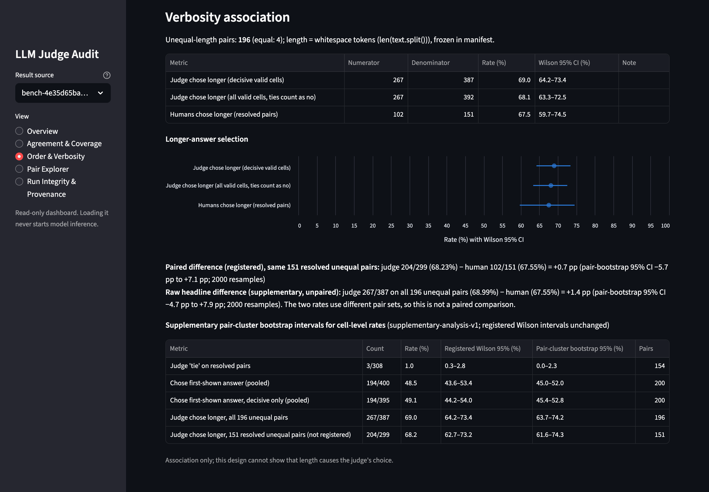
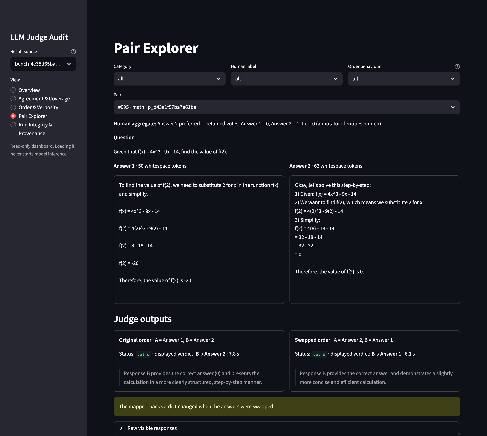
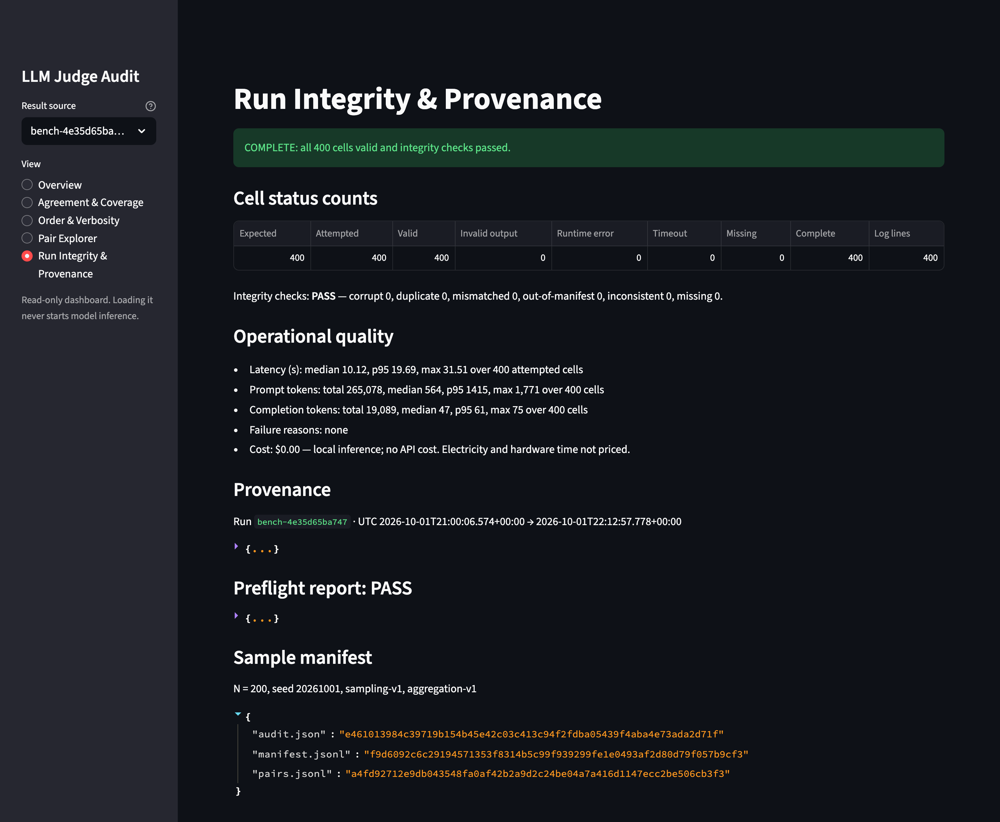

# LLM Judge Audit

**What changes when answer order is swapped?**

This is a completed, reproducible audit:
- **Data:** 200 expert-labelled MT-Bench answer pairs.
- **Judgments:** each pair is judged twice, in original and swapped order, giving 400
  judgments.
- **Model:** one local model (`gemma3:4b` via Ollama). No hosted APIs and no second judge.



**Headline results** (run `bench-4e35d65ba747`, **COMPLETE.** 400/400 valid cells, integrity
checks passed):

- **Agreement with humans:** 237/308 judgments (76.9%) on the 154 pairs with a clear human
  preference. Cohen's κ = 0.540.
- **Order sensitivity:** swapping the answer order changed the verdict for 57/200 pairs
  (28.5%, Wilson 95% CI 22.7–35.1%).

## Results

95% intervals are Wilson score intervals unless marked *pair bootstrap*. Bootstrap intervals
use 2,000 resamples of pair IDs, keeping both orders of a pair together.

- **Registered** metrics were defined, frozen and hashed before inference (`metrics-v1`).
- **Supplementary** figures come from a later, versioned analysis (`supplementary-analysis-v1`)
  that adds to the registered numbers and never replaces them.

| Measure | Count | Rate | 95% CI | Type |
|---|---|---|---|---|
| Agreement with human preference (both orders) | 237/308 | 76.9% | Wilson 71.9–81.3%; pair bootstrap 71.4–82.5% | Registered |
| Cohen's κ, judge vs human | 308 judgments | 0.540 | pair bootstrap 0.422–0.644 | Registered |
| Verdict changed after swapping order | 57/200 | 28.5% | Wilson 22.7–35.1% | Registered |
| Chose the first-shown answer (both orders pooled) | 194/400 | 48.5% | Wilson 43.6–53.4%; supplementary pair bootstrap 45.0–52.0% | Registered |
| Agreement on order-consistent pairs only | 100/116 | 86.2% | Wilson 78.8–91.3% | Registered |
| Judge chose the longer answer (196 unequal-length pairs) | 267/387 | 69.0% | Wilson 64.2–73.4%; supplementary pair bootstrap 63.7–74.2% | Registered |
| Humans chose the longer answer (151 of those pairs) | 102/151 | 67.5% | Wilson 59.7–74.5% | Registered |
| No-model majority baseline (context only) | 85/154 | 55.2% | Wilson 47.3–62.8% | Registered |

<details>
<summary><b>All agreement, verbosity and operational figures</b></summary>

**Agreement** (154 pairs with a resolved human preference)

| Measure | Count | Rate | 95% CI |
|---|---|---|---|
| Agreement, both orders | 237/308 | 76.9% | Wilson 71.9–81.3% |
| Coverage: valid judgments / (2 × resolved pairs) | 308/308 | 100.0% | Wilson 98.8–100.0% |
| Agreement, original order only | 120/154 | 77.9% | Wilson 70.7–83.7% |
| Agreement, swapped order only | 117/154 | 76.0% | Wilson 68.6–82.0% |
| Judge said "tie" on a resolved pair (scored incorrect) | 3/308 | 1.0% | Wilson 0.3–2.8% |
| Leave-one-pair-out majority baseline | 85/154 | 55.2% | Wilson 47.3–62.8% |

- **Original minus swapped agreement:** +1.9 pp, pair bootstrap −5.8 to +9.1 pp.
- **Not scored:**
  - 32 human-tie pairs (the judge said tie on 2 of their 64 cells)
  - 14 unresolved pairs
  - 0 excluded annotations in the sample

**Verbosity** (196 pairs with unequal length; 151 have a resolved human label). Length is the
whitespace-token count, frozen before inference.

| Measure | Count | Rate | 95% CI | Type |
|---|---|---|---|---|
| Judge chose longer, all 196 pairs | 267/387 | 69.0% | Wilson 64.2–73.4% | Registered |
| Humans chose longer, 151 resolved pairs | 102/151 | 67.5% | Wilson 59.7–74.5% | Registered |
| Judge chose longer, same 151 pairs | 204/299 | 68.2% | Wilson 62.7–73.2%; pair bootstrap 61.6–74.3% | Supplementary |

- **Paired difference (registered):** on the same 151 pairs, 68.23% − 67.55% = +0.7 pp.
  Pair bootstrap −5.7 to +7.1 pp.
- **Raw headline difference (supplementary):** 68.99% − 67.55% = +1.4 pp. Pair bootstrap
  −4.7 to +7.9 pp. The two rates cover different pair sets, so this is not a paired
  comparison.

**Operational**

| | |
|---|---|
| Cells | 400 expected · 400 attempted · 400 valid · 0 invalid output · 0 runtime error · 0 timeout · 0 missing |
| Latency per call | median 10.1 s · p95 19.7 s · max 31.5 s (first call, includes model load) |
| Tokens | 265,078 prompt (median 564, max 1,771) · 19,089 completion (median 47) |
| Wall clock / cost | 72.9 min on an Apple M1 MacBook Air (8 GB RAM); no API fees |

</details>

## What the results mean

- **Moderate agreement.** The judge matched the human preference in about three of four
  judgments. This is numerically higher than the no-model majority baseline (85/154, 55.2%), but the denominators differ: judge accuracy is per order-specific judgment, while the baseline is per pair. Agreement is far from perfect (κ = 0.540).
- **No overall first-position preference.** Across both orders the judge picked the
  first-shown answer in 194/400 calls (48.5%, Wilson 43.6–53.4%). Original-order and
  swapped-order agreement differ by only +1.9 pp (pair bootstrap −5.8 to +9.1 pp).
- **But individual pairs are order-sensitive.**
  - The verdict changed for 57/200 pairs. In 54 of the 57 flipped pairs the judge picked the
    *same displayed slot* both times: 25 always the first answer, 29 always the second.
  - Position effects in both directions roughly cancel in the aggregate. They do not cancel
    for the individual comparison.
  - This 54/57 breakdown is a post-hoc description of the saved records, not a registered
    metric.
- **Consistency costs coverage.** Keeping only pairs where both orders agree raises agreement
  to 100/116 (86.2%, Wilson 78.8–91.3%). That covers only 116/154 resolved pairs (75.3%,
  Wilson 68.0–81.5%), so part of the gain comes from abstaining on harder pairs.
- **Length preference resembles the humans'.** On the same pairs, the judge chose the longer
  answer 204/299 times (68.2%) and humans 102/151 times (67.5%). This is an association, not
  evidence that length causes either choice.
- **Error review.** A seeded sample of 20 of 54 incorrect resolved pairs was reviewed by hand.
  - 15 cases chose the same slot in both orders, often with rationales that contradict each
    other across orders.
  - The judge also called a wrong answer correct in 5 maths or reasoning items.

## Supplementary: swap-consistency aggregation (exploratory, post-hoc)


Both order-specific verdicts are mapped back to the original answers. If both pick
the same answer, that answer is the prediction; if both say tie, the prediction is tie; if
they differ, the pair is *abstained*. Human labels are not inputs to the rule; a test checks
that changing every label leaves every prediction unchanged. The mapping was checked against
all 400 saved cells, and every stored prompt hash matched a fresh render of its pair and order.

**Results on the 154 pairs with a resolved human preference.** 116 covered, 38 abstained,
0 unavailable. Intervals are a percentile pair-level bootstrap (2,000 resamples, seed 7531 and
the next five seeds).

| Measure | Count | Rate | 95% CI |
|---|---|---|---|
| Accuracy among covered pairs | 100/116 | 86.2% | pair bootstrap 79.7–92.0% |
| Coverage | 116/154 | 75.3% | pair bootstrap 68.8–81.8% |
| Accuracy over all 154 resolved pairs (abstained = unanswered) | 100/154 | 64.9% | pair bootstrap 57.8–72.7% |
| Original-order judge accuracy, same 154 pairs (100% coverage) | 120/154 | 77.9% | pair bootstrap 70.8–84.4% |

- **Paired differences** (same 154 pairs; aggregated minus original order):
  - Over all resolved pairs: −13.0 pp (pair bootstrap −18.8 to −7.8 pp).
  - Accuracy among covered pairs vs original-order accuracy: +8.3 pp (pair bootstrap +3.6
    to +13.3 pp). The denominators differ (116 vs 154 pairs), so this is a selective-accuracy
    contrast, not like-for-like.
- **Interpretation.** No improvement is claimed. On covered pairs the aggregated prediction
  equals the original-order verdict by construction. The higher accuracy among covered pairs
  comes entirely from abstaining on the 38 order-inconsistent pairs, where the original-order
  verdict was correct in 20/38 (52.6%). Counting those abstentions as unanswered, the rule
  answers correctly on fewer pairs than the original order alone. Covered accuracy and coverage
  equal the registered order-consistent figures (100/116, 116/154); what is new here is the
  pair-bootstrap intervals and the paired comparison.
- **Not scored:** 32 human-tie pairs (19 covered, 13 abstained) and 14 unresolved pairs
  (8 covered, 6 abstained).

## Architecture


- **Judge input:** the question and the two answers, verbatim. Tests check that no human
  labels, annotator IDs, model names or categories reach the judge.
- **Failures:** invalid JSON, schema violations, truncation, errors and timeouts are recorded
  as failures, never as verdicts. None occurred in this run.

## Dashboard

`uv run streamlit run app/streamlit_app.py` opens a read-only dashboard over the saved run.
Loading it never calls the model. Views can be deep-linked, e.g.
`?view=pairs&pair=p_d43e1f57ba7a61ba`.

| Agreement & Coverage | Order robustness |
|---|---|
| [](docs/screenshots/agreement.png) | [](docs/screenshots/order.png) |
| Agreement, coverage and baseline with intervals. | Verdicts by order and first/second-slot choice. |
| **Verbosity** | **Pair Explorer** |
| [](docs/screenshots/verbosity.png) | [](docs/screenshots/pair_explorer.png) |
| Longer-answer rates, paired difference and supplementary clustered intervals. | A flipped pair: the judge chose slot B in both orders, so it endorsed f(2) = 0, then f(2) = −20. |
| **Run Integrity & Provenance** | |
| [](docs/screenshots/integrity.png) | |
| Cell status counts, integrity checks, latency, tokens and hashes. | |

Screenshots are Chrome renders of the dashboard against the committed run.

## Reproduce

Requirements: [uv](https://docs.astral.sh/uv/) and Python 3.12+. The commands below need no
model, no GPU and no network; the raw data is committed with pinned checksums.

```bash
uv sync                                    # install pinned dependencies from uv.lock
uv run pytest                              # offline test suite (synthetic fixtures + checks on saved results)
uv run lja rebuild-data                    # rebuild the 200-pair sample from pinned raw data
uv run lja rebuild-data --check            # confirm the rebuilt files are byte-identical
uv run lja integrity                       # re-validate the saved 400-cell log (read-only)
uv run streamlit run app/streamlit_app.py  # launch the dashboard
```

**Inference commands.** Only these call the model. They require local Ollama with the exact
frozen `gemma3:4b` digest, and refuse to run otherwise.

| Command | Model calls |
|---|---|
| `uv run lja run --approved` | the 400 benchmark judgments; resumes and never re-runs a recorded cell |
| `uv run lja probe` | at most 2 synthetic test calls; stored separately, not benchmark data |

`uv run lja --help` lists the remaining commands (download, freeze, preflight, analyze,
supplementary, swap-consistency). `uv run lja swap-consistency` recomputes the post-hoc
swap-consistency artifact from the saved records without calling the model.

## Method

- **Sample.** Turn-1 pairs only. Candidates are deduplicated by exact text, and pairs with
  identical answers are excluded. 25 pairs are drawn from each of the 8 MT-bench categories
  (seed 20261001).
- **Human labels.** Expert votes are aggregated by strict plurality. Repeat votes from one
  annotator count once; conflicting votes are dropped. Ties and unresolved pairs stay
  separate and are never scored. Every exclusion is logged in `data/derived/audit.json`.
- **Judging.** One frozen prompt (`prompts/judge_prompt_v1.txt`) is used for both orders. The
  swapped call exchanges only the answer positions, and verdicts are mapped back to the
  original answers.
- **Statistics.**
  - Wilson intervals are used for rates.
  - Kappa and paired differences use a pair-cluster bootstrap.
  - The error-review sample was drawn with a fixed seed (4242), after the metrics were saved.

## Data, license and provenance

- **Dataset:** MT-Bench Human Judgments, `lmsys/mt_bench_human_judgments`, `human` split.
  - Revision `f7d2896d2cc5d80f8b55c2bbc722613555233c25`, license **CC-BY-4.0**.
  - Zheng et al., *Judging LLM-as-a-judge with MT-Bench and Chatbot Arena*, arXiv:2306.05685
    (2023).
  - The GPT-4-judgment split is not used.
- **Categories:** MT-bench `question.jsonl` from `lm-sys/FastChat` @ `b494d0c`
  (Apache-2.0).
- **Changes made:** turn-1 filter, deduplication, vote aggregation and sampling. Human labels
  are never edited.
- **Third-party responses:** the candidate answers were written by third-party models and are
  used for non-commercial research evaluation only.
- **Full attribution:** `data/derived/ATTRIBUTION.md`.
- **Run:**
  - `bench-4e35d65ba747`, executed 2026-10-01 21:00–22:13 UTC from clean commit `6e72ff3`.
  - Study hash `4e35d65b…`; manifest SHA-256 `f9d6092c…`.
  - `gemma3:4b` digest `a2af6cc3…195f5a`, Q4_K_M, Ollama 0.24.0.
  - Apple M1, 8 GB RAM, macOS 26.3.1.
  - Full record: `results/runs/bench-4e35d65ba747/provenance.json`.
- **Reporting correction (2026-10-02):** the verbosity paired difference is now labelled as
  using the 151 resolved pairs. An audit found no metric defect, and saved results are
  unchanged.
- **Code license:** Apache-2.0.

## Limitations

- **Single model, exploratory scope.** One small local judge, one prompt, N = 200 pairs from
  one benchmark. Intervals are wide, and the results do not generalise to other judges,
  prompts, domains or multi-turn conversations.
- **Noisy human labels.**
  - 109 of the 200 pairs rest on a single retained vote.
  - 32 pairs are human ties and 14 are unresolved.
  - Agreement is measured against these labels, not against ground truth.
- **Contamination risk.** MT-Bench questions and answers have been public since 2023 and may
  be in Gemma's training data.
- **Determinism.** Temperature 0 does not guarantee identical outputs on rerun.
- **Interval caveat.** Registered Wilson intervals on pooled rates treat a pair's two
  judgments as independent. The supplementary pair-clustered intervals shown alongside can be
  wider or narrower.
